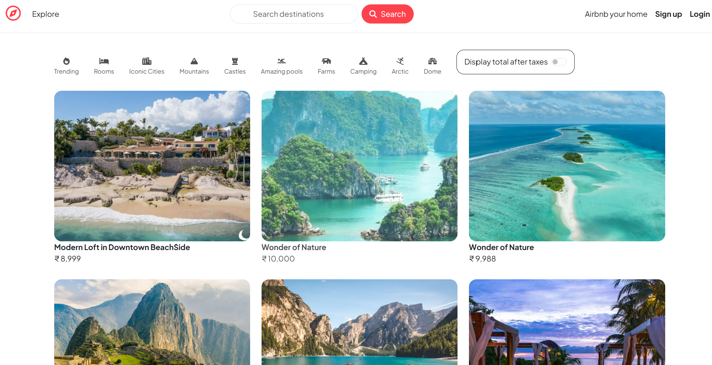
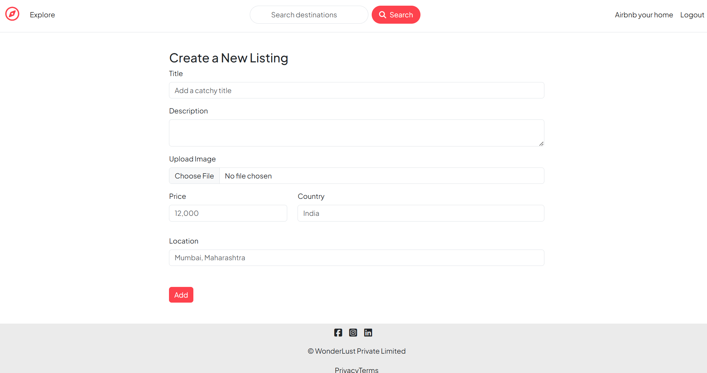
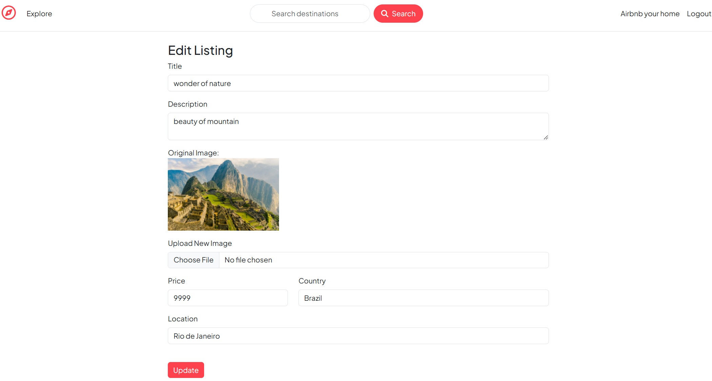
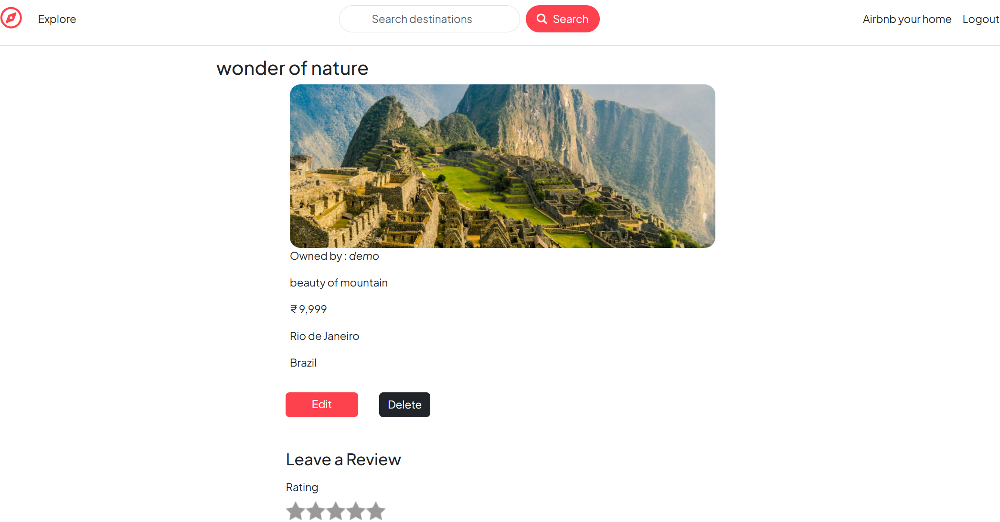
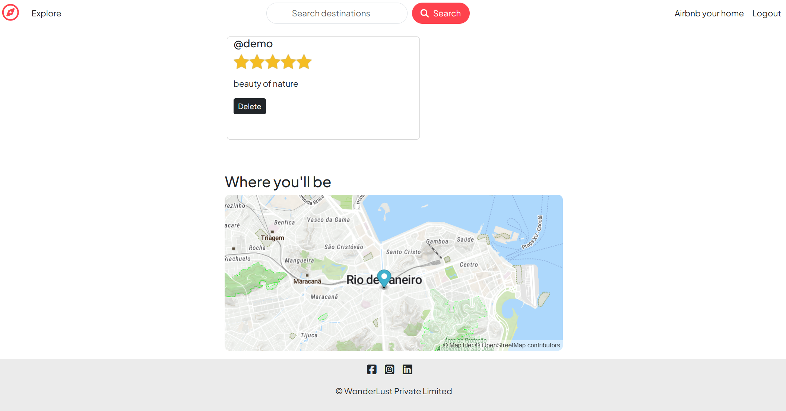
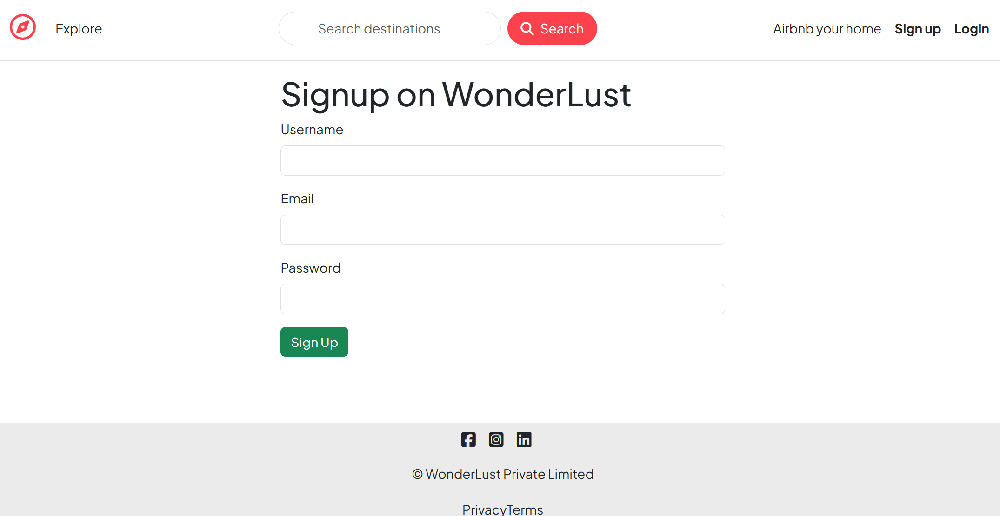
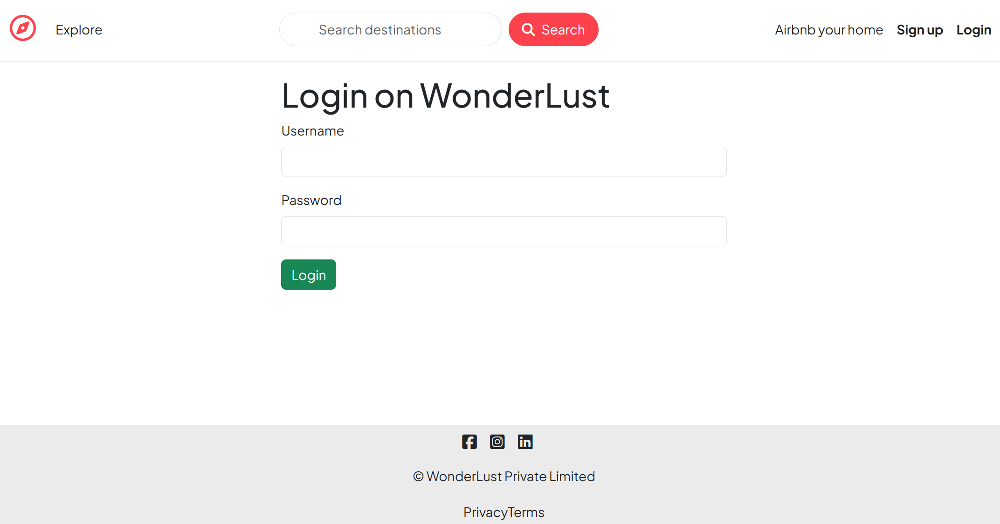

# Wonderlust - Share Your World 🌍

A full-stack travel listing platform where users can discover, share, and review unique travel destinations around the world. Built with Node.js, Express, MongoDB, and modern web technologies.

## Live Demo

**[Visit Wonderlust](https://wonderlust-share-your-world.onrender.com)**

## Features

- User Authentication (Register / Login / Logout)
- Create, Edit & Delete Listings
- Image Upload with Cloudinary
- Interactive Maps using MapLibre + MapTiler
- Automatic Location Geocoding (OpenStreetMap / Nominatim)
- Review & Rating System
- Flash Messages (Success / Error)
- Secure Sessions using MongoDB Store
- Fully Responsive UI with Bootstrap
- Deployed on Render

## Tech Stack

### Backend

- **Node.js** - Runtime environment
- **Express.js** - Web application framework
- **MongoDB** - NoSQL database
- **Mongoose** - MongoDB object modeling

### Authentication & Security

- **Passport.js** - Authentication middleware
- **Passport-Local** - Local authentication strategy
- **Express-Session** - Session management
- **Connect-Mongo** - MongoDB session store

### View Engine & Templating

- **EJS** - Embedded JavaScript templating
- **EJS-Mate** - Layout support for EJS

### Middleware & Utilities

- **Body-Parser** - Request body parsing
- **Express-Validator** - Input validation and sanitization
- **Multer** - File upload handling
- **Cloudinary** - Cloud image storage and management
- **Method-Override** - HTTP verb support (PUT, DELETE)
- **Connect-Flash** - Flash message middleware
- **Dotenv** - Environment variable management

### Frontend

- **Bootstrap** - Responsive CSS framework
- **MapLibre GL JS** - Interactive maps
- **MapTiler** - Map tiles and geocoding

## Project Structure

```
wonderlust/
├── models/
│   └── user.js              # User model schema
├── routes/
│   ├── listing.js           # Listing routes
│   ├── review.js            # Review routes
│   └── user.js              # User authentication routes
├── utils/
│   └── ExpressError.js      # Custom error handling
├── views/
│   ├── layouts/             # EJS layout templates
│   ├── listings/            # Listing views
│   ├── reviews/             # Review views
│   ├── users/               # User auth views
│   └── error.ejs            # Error page template
├── public/
│   ├── css/                 # Stylesheets
│   ├── js/                  # Client-side JavaScript
│   └── images/              # Static images
├── .env                     # Environment variables (create this)
├── .gitignore              # Git ignore file
├── app.js                  # Main application file
├── package.json            # Project dependencies
└── README.md               # Project documentation
```

## API Routes

### Authentication Routes

```
GET    /signup              - Display signup form
POST   /signup              - Register new user
GET    /login               - Display login form
POST   /login               - Authenticate user
GET    /logout              - Logout user
```

### Listing Routes

```
GET    /listings            - View all listings
GET    /listings/new        - Display create listing form
POST   /listings            - Create new listing
GET    /listings/:id        - View single listing
GET    /listings/:id/edit   - Display edit listing form
PUT    /listings/:id        - Update listing
DELETE /listings/:id        - Delete listing
```

### Review Routes

```
POST   /listings/:id/reviews        - Add review to listing
DELETE /listings/:id/reviews/:revId - Delete review
```

## Security Features

- **Password Hashing**: User passwords are hashed using Passport-Local-Mongoose
- **Session Security**: HTTP-only cookies with configurable expiration
- **Environment Variables**: Sensitive data stored in `.env` file
- **Input Validation**: Server-side validation for all user inputs

## Screenshots





  



## Author

Aman Dhakate

- GitHub: [amandhakate27](https://github.com/amandhakate27)
- LinkedIn: [amandhakate](https://linkedin.com/in/amandhakate)

**Made with ❤️ for travelers around the world**
